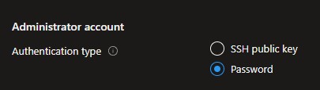
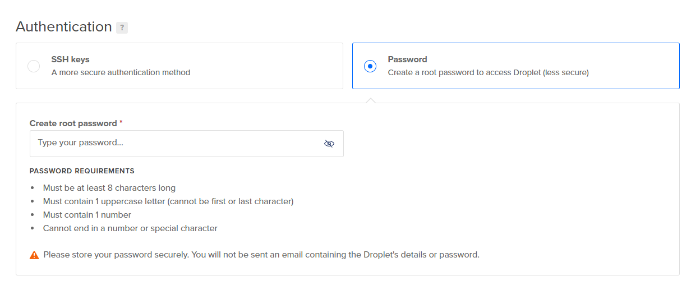
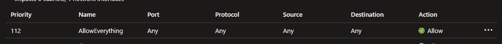

# Awesome Secured Config

My Compilation of Configuration in public cloud that make your service _very secured_ (?)

- Postgresql Config in [/postgres](/postgres)

- Setting up Virtual Machine for extra _security_

  

  

- Setting up secure networking

  
